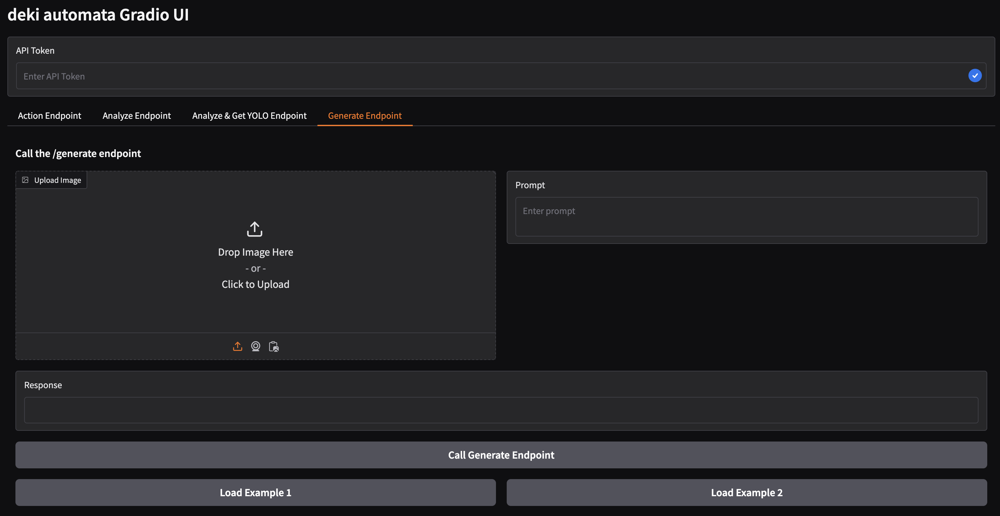
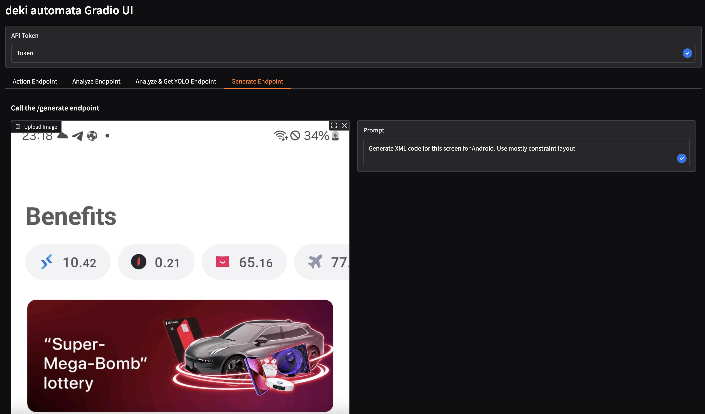

# deki

**deki** is an ML model (or several models) that detects UI elements in
screenshots (such as containers, text, and icons) and provides structured
descriptions of those elements. It can help with:

- Generating code by using LLMs that need structured UI information. (Demo is available)
- Help with building AI agents by providing precise bounding box coordinates and sizes. (Demo is available)
- Assisting visually impaired users by describing the UI.

---

## How It Works

1. **Object Detection**  
   Runs YOLO (trained to detect `View` containers, `Text`, `ImageView` icons/images, and `Line` elements) on the input image.

2. **Cropping & Processing**  
   - **Text boxes**: Crop each box and use a deep neural network (DNN) to enhance the text region, then perform OCR (by using EasyOCR) and apply a spell checker to correct mistakes.  
   - **View/Line boxes**: Extract background color and alpha information.  
   - **ImageView boxes**: Determine if the element is an icon-like graphic or a real image (e.g., a person or a car).

3. **Image Captioning (Optional)**  
   Use an image captioning model (e.g., BLIP-2, LLaMA-vision, etc.) to produce an overall description of the ImageView bounding box.

---

## Usage

Install dependencies (Python 3.12 recommended):

```bash
git clone https://github.com/RasulOs/deki.git
cd deki
python3.12 -m venv .venv
source .venv/bin/activate
pip install -r requirements.txt
```

Full Pipeline (raw text based output):

```bash
python3.12 wrapper.py \                                             
   --input_image ./res/bb_1.jpeg \ 
   --weights_file ./best.pt \
   --icon_detection_path ./icon-image-detection-model.keras
```

Full pipeline without image detection and image captioning (much faster),
with json structured output and skipping a spell checker (recommended):

```bash
python3.12 wrapper.py \
   --input_image ./res/bb_1.jpeg \
   --weights_file ./best.pt \
   --no-captioning \
   --json --skip-spell 
```

Same as above but json-mini is used. json-mini has a smaller output size,
recommended for AI agents (it is also a default configuration for an /action 
endpoint used by AI agents):

```bash
python3.12 wrapper.py \
   --input_image ./res/bb_1.jpeg \
   --weights_file ./best.pt \
   --no-captioning \
   --json-mini --skip-spell 
```

YOLO-Only

```bash
python3.12 yolo_script.py ./res/home_1.png ./best.pt
```

And don't forget to include your HuggingFace and OpenAI tokens if you use blip2 or ChatGPT
(if you didn't pass --no-captioning). ChatGPT token is needed for server.

Also, to use this version you need to install llama-3.2-11b via ollama.  
(if you didn't pass --no-captioning)

You can see an example of usage for the **code generation** (and for other things) 
in gradio section.

If you want a production ready code generator or AI agent then fine-tune the model to get
high quality results because the image description is quite long and complex.

---

## YOLO examples

You can see examples in the result/ and output/ folders.

Bounding boxes with classes for bb_1:


Bounding boxes without classes but with IDs after NMS for bb_1:


Bounding boxes with classes for bb_2:


Bounding boxes without classes but with IDs after NMS for bb_2:


Text output will look something like this (if --json and --no_captioning are not specified):
```text
Image path: ./bb_1.jpeg
Image Size: width=1080, height=2178
********
View: region_1_class_0 (View)
Coordinates: x_min=606, y_min=393, x_max=881, y_max=510
Size: width=275, height=117
1. The background color of the container is whitesmoke.
2. The container is opaque.
********
...
********
Image: region_8_class_1 (ImageView)
Coordinates: x_min=64, y_min=574, x_max=1026, y_max=931
Size: width=962, height=357
Prediction: Normal Image
The image appears to be an advertisement for a lottery, with the title "Super-Mega-Bomb" Lottery prominently displayed at the top. The background of the image features a bold red color scheme.

* A car:
	+ The car is depicted in black and white.
	+ It is positioned centrally in the image.
	+ The car appears to be a sleek, modern vehicle.
* A phone:
	+ The phone is shown in the bottom-right corner of the image.
	+ It has a red screen with a pink background.
	+ The phone's design suggests it may be a high-end model.
* A credit card:
	+ The credit card is displayed in the top-left corner of the image.
	+ It features a black and red color scheme.
	+ The credit card appears to be from "bitbank".
* Other objects:
	+ There are several other objects scattered throughout the image, including a tablet, a pair of earbuds, and a small device with a screen.
	+ These objects appear to be related to technology or electronics.

Overall, the image suggests that the lottery offers prizes that include high-end electronic devices and vehicles. The use of bright colors and modern designs creates a sense of excitement and luxury, implying that the prizes are valuable and desirable.
********
...
********
Text: region_38_class_2 (Text)
Coordinates: x_min=69, y_min=1268, x_max=252, y_max=1310
Size: width=183, height=42
Extracted Text: 64 partners
Corrected Text: 64 partners
********
```

if --json and --no-captioning are specified the output will look something like this:
```json
{
  "image": {
    "path": "./res/bb_1.jpeg",
    "size": {
      "width": 1080,
      "height": 2178
    }
  },
  "elements": [
    {
      "id": "region_1_class_Text",
      "x_coordinates_center": 942,
      "y_coordinates_center": 46,
      "width": 225,
      "height": 56,
      "extractedText": "34%",
      "correctedText": "34%"
    },
    {
      "id": "region_2_class_ImageView",
      "x_coordinates_center": 158,
      "y_coordinates_center": 47,
      "width": 267,
      "height": 55
    },
    {
      "id": "region_67_class_Text",
      "x_coordinates_center": 972,
      "y_coordinates_center": 2108,
      "width": 77,
      "height": 37,
      "extractedText": "More",
      "correctedText": "More"
    },
    {
      "id": "region_68_class_Text",
      "x_coordinates_center": 107,
      "y_coordinates_center": 2109,
      "width": 90,
      "height": 37,
      "extractedText": "Home",
      "correctedText": "Home"
    }
  ]
}
```

and if --json-mini, --skip-spell and --no-captioning are specified the output
will look something like this:
```json
{
  "image_size": "[1080,2178]",
  "bbox_format": "center_x, center_y, width, height",
  "elements": [
    {
      "id": "text_1",
      "bbox": "[942,46,225,56]",
      "text": "34%"
    },
    {
      "id": "image_2",
      "bbox": "[158,47,267,55]"
    },
```

I have not used the best examples that do not have errors, so as not to give
people a false impression of the accuracy of the model. The examples you see
are approximately the standard result that can usually be obtained using this
model.


---

## Code generation comparison. GPT-4o vision vs GPT-4o + deki

This model can be used by an LLM to better understand an image’s view
structure, coordinates, and view sizes. I used 4 examples for
comparison. For the experiment, I used the latest GPT-4o model (as of January
26 2025) to generate code from a screenshot, and then to generate code from the same
screenshot + deki image description. Without any fine-tuning.

The generated code is for Android and was placed into the Design Preview in 
Android Studio without any changes.

Better understanding of sizes (source code: ./res/mfa_1_gpt_4o.md and ./res/mfa_1_gpt_4o_deki.md):


Better structure and coordinates (source code: ./res/mfa_2_gpt_4o.md and ./res/mfa_2_gpt_4o_deki.md):


Better structure (source code: ./res/bb_1_gpt_4o.md and ./res/bb_1_gpt_4o_deki.md):


Better coordinates (source code: ./res/bb_2_gpt_4o.md and ./res/bb_2_gpt_4o_deki.md):


---

## Server init 

To run server locally:
```bash
source .venv/bin/activate
uvicorn app.main:app --reload --host 0.0.0.0 --port 8000
```

Don't forget that a server expects 2 tokens. A first one for OpenAI and the
second token for your backend (you can enter anything you want for the second
one). 
```python
OPENAI_API_KEY = os.environ.get("OPENAI_API_KEY")
API_TOKEN = os.environ.get("API_TOKEN")
```
---

## deki automata: AI agent (Android)

The code for android agent is in /android package.

Demos:

Prompt: Open signal and say what was the last message from my friend Omar
[Youtube](https://www.youtube.com/shorts/-Ctf6QEXQw8)

Prompt: go home, and swipe left, then right, then up, then down
[Youtube](https://www.youtube.com/shorts/x5w6dC6bFmw)

Prompt: Open linkedin,  tap post and write: hi, it is deki, and now I am open
sourced. But don't send, just return
[Youtube](https://www.youtube.com/shorts/4D4JuQKJ48c)

---

## Gradio (Web frontend)

First, run a server locally and then run gradio client:
```bash
python3.12 ./ui/uigrad.py
```

/action endpoint: for asking questions about objects on the image


/generate endpoint: you can ask anything you want about the image 


/generate endpoint: for example, you can ask the model to generate the code for Android


---

## YOLO model accuracy

The base model is a YOLO model that was trained on 486 images and was tested on 60 images.

Current YOLO model accuracy:


---

## Future plans

    1. Make the image captioning functionality optional. Done.
    2. Increase accuracy of the YOLO model by increasing the size of the training dataset up to 1000 images/labels. 
    3. Increase accuracy of the icon detection model by improving training data quality.
    4. Fine-tune LLM for generating UI code from detected elements.
    5. Add the command mode to generate short image description files. Done.
    6. Add an example of AI agent that can automate tasks in an Android OS using deki. Done.
    7. Fine-tune LLM for better AI agent capabilities. 
    8. Decrease the size of deki output to reduce the usage of LLM's context
       window. Every region should have 1 line description.
    9. Add an iOS agent demo.
    10. Add a comparisson with other AI agents.
    11. Add an option to run deki fully locally on the device without internet
        access (Object detection, OCR, Image Processing, LLM)

---

## Contributing

Fork this repo and create your own project or contribute to this project - both are ok. 
Just don't forget about license.

Also, you can open issues or you can send me an email or write me in the linkedin about improvements/problems.

---

## License

GPLv3
